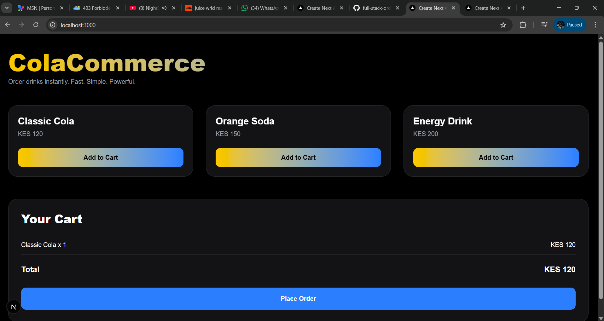
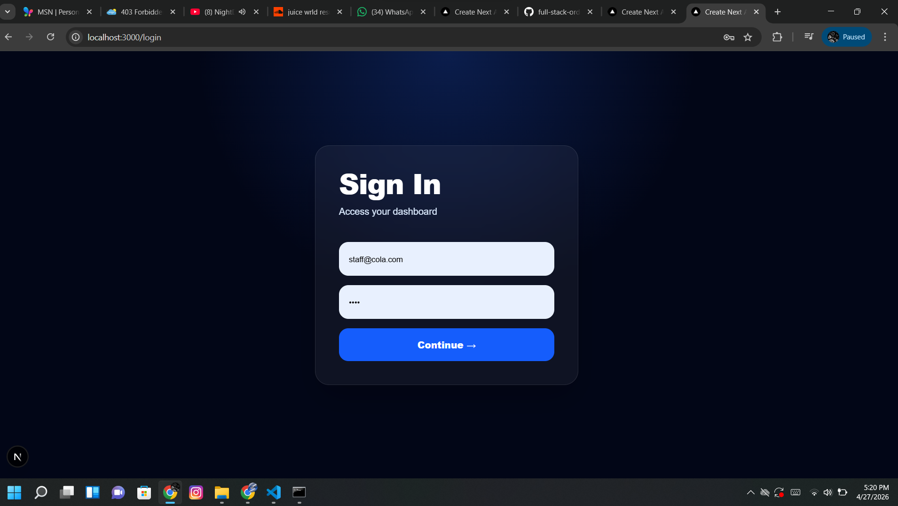
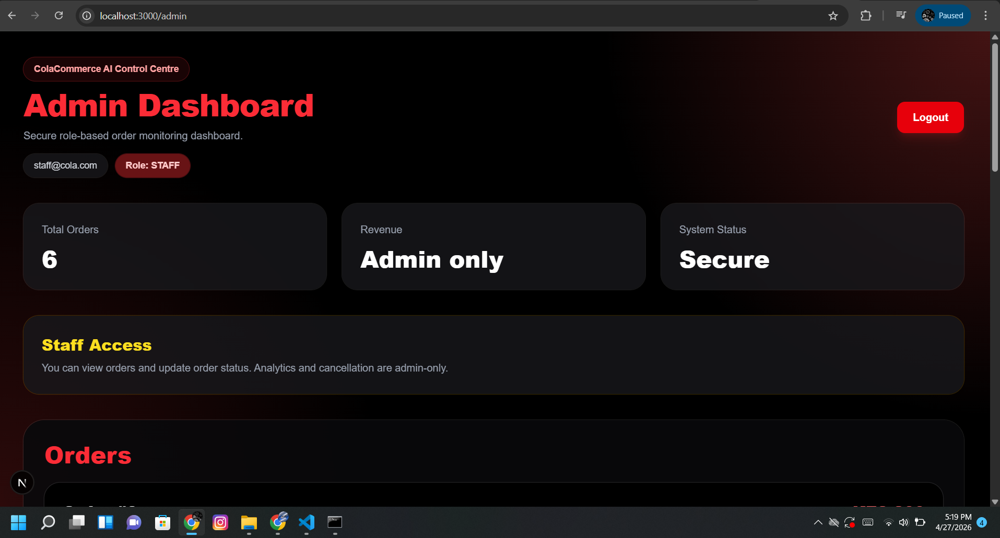

# ColaCommerce AI 

its a simple full-stack drink ordering system with admin and staff dashboard.
A full-stack ordering system with authentication and role-based access.

## Features
- Customers place orders
- Staff update order status
- Admin monitors system and revenue

## Demo Flow
1. Customer places order
2. Staff logs in and updates status
3. Admin views dashboard


##  What this project does

This app allows the following roles

- Customers to order drinks
- Staff to update order status
- Admin to monitor orders and revenue

It simulates a real business system.


##  User Roles

###  Customer
- View products
- Add to cart
- Place orders

###  Staff
- View orders
- Update order status (Preparing / Delivered)

###  Admin
- Full access
- View analytics (revenue, total orders)


## Tech Stack

- Frontend: Next.js (React)
- Backend: Node.js (Express)
- Database: PostgreSQL
- Auth: JWT (JSON Web Tokens)


## Pages

| Page | URL |
|------|-----|
| Customer | http://localhost:3000 |
| Login | http://localhost:3000/login |
| Dashboard | http://localhost:3000/admin |


## Login Accounts

### Admin
Email: kelvinyegon58@gmail.com  
Password: 8573  

### Staff
Email: staff@cola.com  
Password: (your set password)


##  How to run the project
double click on the start-project file then on your browser add this in order to get the 
admin the customer page the staff page and the ordering page

| Page | URL |
|------|-----|
| Customer | http://localhost:3000 |
| Login | http://localhost:3000/login |
| Dashboard | http://localhost:3000/admin |

## Screenshots

### Customer Ordering Page


### Login Page


### Admin Dashboard


### 1. Start backend
```bash
cd backend
npx nodemon server.js
 
to get this code git clone :git remote add origin https://github.com/kelvinyegon/full-stack-ordering-system.git